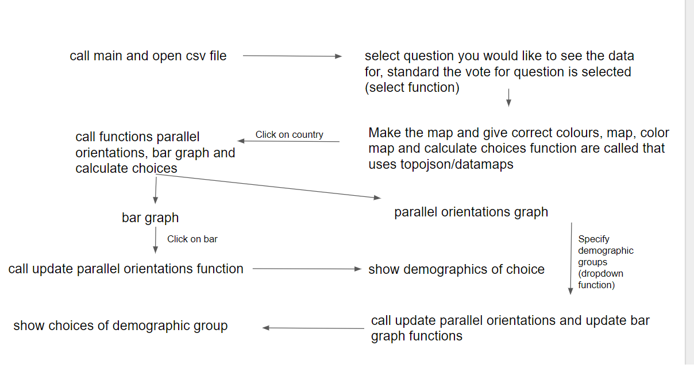

# Project design
Name: Daphne Box
Student number: 10455701

## Data sources
The data about the basic income opinions comes from Kaggle.com and is a downloaded csv file.

## Filters and data transformaties
Map: for the map the question selected in the drop-down menu is used to filter the data on question, the 4 different answers on the question are counted and the most selected choice for a country is shown in a specified color on the map.

Barchart: filter on question and clicked country, at start the percentages of the answers is shown, when the parallel orientations graph is clicked the percentages of the answers is shown per selected demographic unit of the population that is selected.   

Parallel orientations graph: parallel orientations graph shows the demographics of the correspondents of the questionaire and their answers when clicked on a certain bar of the bar graph the chart changes to select/show the demographics of the people that have given a certain answer.

## Technical component diagram

## Code components
* Main (loads the data and calls all the functions)
* Function for dropdown
* Function for map
* Function to color the map
* Function for bar graph
* Function to calculate the total choice responses of participants per country
* Function for parallel orientations graph
* Update function for bargraph and parallel orientations graph after map click
* Update function bar graph after selection of parallel orientations graph
* Update function parallel orientations graph after click on bar

## Plugins for D3
* D3 tooltip
* Topojson/datamaps