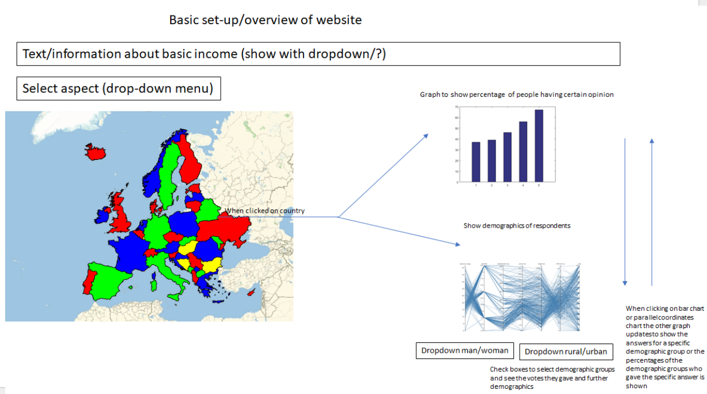

# Programing-project
Name: Daphne Box  
Student number: 10455701

## Background of the project
The last couple of years the idea of a basic income is regaining public interest and the discussion about the basic income resurgence.
Due to the increased interest, it is worthwhile to investigate the brought opinion about the basic income and if there is a relation between opinion about basic income and demographics in different European countries.

## Problem statement
Because at present there are no visualizations available about the public opinion of basic income, it is hard to really pinpoint the actual opinion about the basic income and its division over the population per European country. The main target audience of this project will be people with interest in the basic income. 

## Solution of the problem
The solution to this problem is to create a website that shows a map of Europe where the countries are colored according to a specific opinion about an aspect of the basic income and when clicked on the country the division of that opinion over the population is shown in total and pie chart with the demographics of the interviewed people is shown, the pie chart and bar graph will interact on click basis.

## Datasets
The dataset that is used to build this website comes from kaggle.com.
Furthermore, I will likely need to use the following libraries: d3, d3-tip, d3-queue, topojson/datamaps.  

## Visualisation

