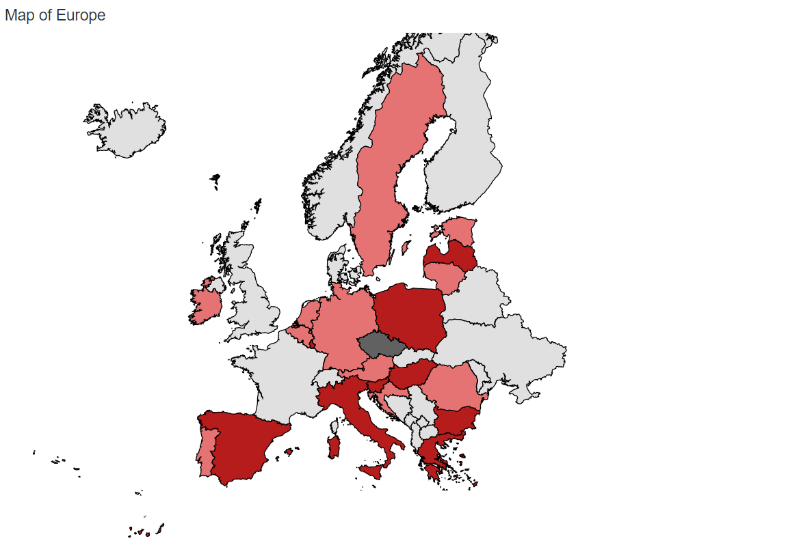

# Progress book Daphne Box

## Monday 8th of January 2018
During the first day of the programming project, I have been thinking about the topic and implementation of certain visualisations about this topic for the programming project.
The first idea I had was to do the programming project about the basic income of which the data about the basic income was comming from a questionaire performed by Dalia which I found on Kaggle.com. For this project I first thought to make a map of Europe where the countries were coloured according to the most chosen answer to a question, and the displayed question could be chosen out of a dropdown. When clicked on a country all percentages of chosen answers on the selected question were showed in a bar graph and the demographics of the population was shown in a pie chart. This first idea was judged to be too easy to implement.

The second idea changed the pie chart to a sunburst and included interactivity between the bar graph and sunburst so you could select or show a demographic group when you would click on an answer in the bar graph or click on a demographic group in the sunburst and the bar graph would show their answers. The second idea did lack a second drop-down, slider or check-box and therefore it was suggested to incorporate a second data-set so it could be added. Furthermore background information about the basic income and the dataset should be included on a second tab of the website. For this idea a README.md was written that included an image about the webpage lay-out. 

## Tuesday 9th of January 2018
On the second day of the programming project a third idea for the project was proposed where the sunburst was changed to a parrallel orientations graph with the two binary choice options included in dropdowns so all requirements were met and individual choices could be displayed for all participants or for a certain group of participants. This last idea was approved.

The rest of the day was spend to make a Design.md that described the idea further and included all the functions necessary to make the visualisations and website work.

## Wednesday 10th of January 2018
Today a visualisation for the Design.md was made and included in the document.

## Thursday 11th of January 2018
Today a start with the programming for the webpage was made that mainly included to create the two-tabs for the webpage and a stat was made to make the visualisation of the map.

## Friday 12th of January 2018
Further progress with the map was made, the countries of Europe can be drawn and a start was made to make determine the colors of the map. However with the last step it was discovered that the countries codes of the map were displayed in three letter codes and the countries codes in the data set were two letter codes. Therefore a start was made to write a conversion file in python that includes all data and a two and three letter country code.

## Monday 13th of January 2018
Today I spend the day to incorporate bootstrap to my tab that shows the data visualisations. This first did not seem to work unless one class mate pointed at the fact that I should include certain tags in the header. Than it was immedeately working.
The other I did today was to convert my data so that it included the three country codes as well. First the computer put all the data in one column. Then I solved it by including a comma behind all variables and column names, but the computer still could not read the file correctly because all fields except the first columns contained an additional space. In the end it turned out that this space was included and all extra comma's needed to be included because I wrote in python that the writer file should deliminiter on comma instead of space.

## Tuesday 14th of January 2018
I have spend most of the day for coloring the countries which had mostly troubles because of asynchronity. When that was solved it turned out that not all id's of the card were normal three country codes but that changing the codes manually did only solve the problem partially. At the end of the day card looked like this: 
